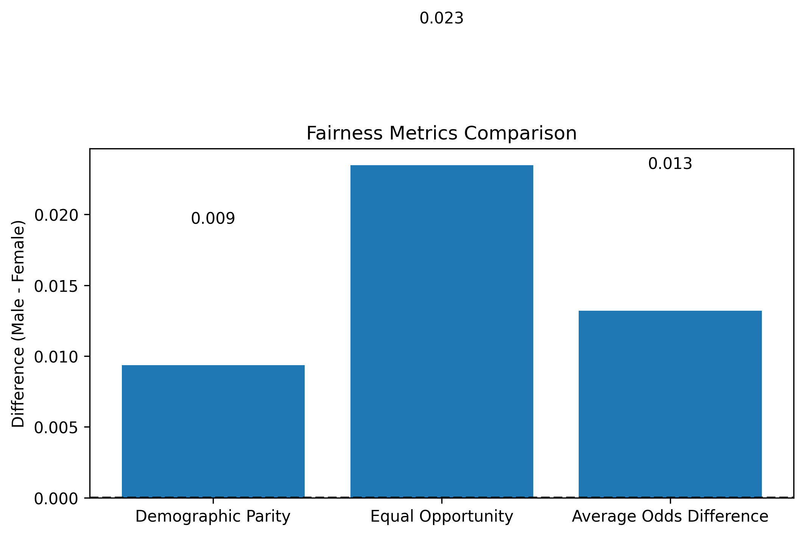
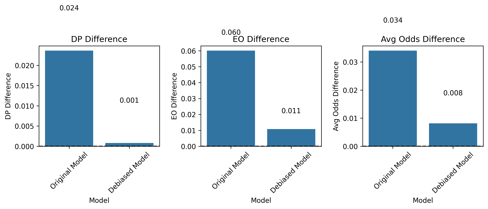

# Fairness-Aware Hiring Model Analysis Report

To run this project, install the following packages:

| Package        | Description                                      | Install Command            |
| -------------- | ------------------------------------------------ | -------------------------- |
| `pandas`       | Data manipulation and analysis                   | `pip install pandas`       |
| `numpy`        | Numerical computing                              | `pip install numpy`        |
| `matplotlib`   | Plotting and visualization                       | `pip install matplotlib`   |
| `seaborn`      | Statistical data visualization                   | `pip install seaborn`      |
| `scikit-learn` | Machine learning library (modeling & evaluation) | `pip install scikit-learn` |
| `fairlearn`    | Fairness evaluation metrics and mitigation       | `pip install fairlearn`    |
| `lime`         | Model interpretability via LIME                  | `pip install lime`         |

## 📁 Project Structure: `UNCOVER_BIAS`

```plaintext
UNCOVER_BIAS/
├── add_resume.py                 # Generate resume summaries from candidate data
├── model0.py                     # Main TF-IDF + Logistic Regression model, data prep, and LIME
├── debiased_model.py             # Debiased model with fairness-aware evaluation
│
├── plain_resumes.csv             # Processed resumes with gender and hiring decision
├── original_dataset.csv          # Original raw dataset
│
├── fairness_metrics0.png         # Baseline fairness: demographic parity
├── fairness_metrics1.png         # Baseline fairness: comparison of metrics
├── fairness_metrics_debiased.png # Debiased model fairness metrics
│
├── lime_case_1.png               # LIME explanation for Case 1
├── lime_case_2.png               # LIME explanation for Case 2
├── lime_case_3.png               # LIME explanation for Case 3
├── lime_case_4.png               # LIME explanation for Case 4
├── lime_case_5.png               # LIME explanation for Case 5
```


## 1. Dataset Description
### Data Source
- Original dataset: `original_dataset.csv` (structured hiring records) with 11 feautres:
`Age,Gender,EducationLevel,ExperienceYears,PreviousCompanies,DistanceFromCompany,InterviewScore,SkillScore,PersonalityScore,RecruitmentStrategy,HiringDecision`
- Augmented with synthetic resume text via `generate_resume_text()` function in the `add_resume.py` file to allow the use of a text classification model.
- The Dataset was split into Training Dataset(70% Male,30% Female) and Testing dataset(30% Male and 70% Female) to implement representation imbalance in the training Dataset.

### Feature Encoding
| Feature | Encoding |
|---------|----------|
| Gender | 0 = Female, 1 = Male |
| Education | 1=HS, 2=Bachelor, 3=Master, 4=PhD |
| Recruitment | 1=Campus, 2=Job Portal, 3=Referral |

### Sample Resume Text
`
"female applicant, age 30.0. She has high school and 8.0 years of experience. She has worked at 5.0 companies and lives 39.9 km from office. She scored 18.0/100 in the interview, 51.0/100 on skill tests, and 25.0/100 on personality assessments. She applied via job portal" `

## Model Architecture & Performance
#### A simple TF-IDF + Logistic Regression model was used.

### 1. Pipeline Design
```python
from sklearn.pipeline import Pipeline
from sklearn.feature_extraction.text import TfidfVectorizer
from sklearn.linear_model import LogisticRegression
```
# Baseline Model
```python 
baseline_pipe = Pipeline([
    ('tfidf', TfidfVectorizer(
        max_features=5000,
        stop_words=['male applicant', 'female applicant']  # Gender term removal
    )),
    ('clf', LogisticRegression(
        class_weight='balanced',
        max_iter=1000,
        random_state=42
    ))
])
```

# Debiased Model (Fairlearn)
```python
from fairlearn.reductions import ExponentiatedGradient
debiased_pipe = Pipeline([
    ('tfidf', TfidfVectorizer(max_features=5000)),
    ('mitigator', ExponentiatedGradient(
        estimator=LogisticRegression(max_iter=1000),
        constraints=EqualizedOdds(),
        eps=0.1
    ))
])
```
# Model Performance
## Model Accuracy
### 🧪 Baseline Model - No Debiasing

**Accuracy:** `0.8280`

| Class / Avg     | Precision | Recall | F1-Score | Support |
|-----------------|-----------|--------|----------|---------|
| **Class 0**     | 0.89      | 0.85   | 0.87     | 521     |
| **Class 1**     | 0.70      | 0.77   | 0.74     | 235     |
| **Accuracy**    | —         | —      | 0.83     | 756     |
| **Macro Avg**   | 0.80      | 0.81   | 0.80     | 756     |
| **Weighted Avg**| 0.83      | 0.83   | 0.83     | 756     |

## Fairness Analysis




# Explainability results 
## LIME results
Gender Keyword Influence Summary:
5/5 cases showed gender-related terms in top features

```
Fairness Metrics:
    Demographic Parity: 0.0094
     Equal Opportunity: 0.0235
Average Odds Difference: 0.0132

Interpretation:
Positive values indicate bias toward male applicants
Negative values indicate bias toward female applicants
Zero indicates perfect fairness

==================================================
Case 1: Hire
True Label: Hire
Gender: Female

Resume Excerpt:
 female applicant, age 42.0. She has masters degree and 9.0 years of experience. She has worked at 3.0 companies and lives 40.2 km from office. She scored 79.0/100 in the interview, 71.0/100 on skill tests, and 12.0/100 on personality assessments. She applied via job portal....

Top Influential Features:
79                                                 0.139
masters                                            0.119
71                                                 0.086
job                                                -0.082
portal                                             -0.081
42                                                 -0.078
She                                                -0.041
and                                                -0.032
degree                                             -0.020
100                                                -0.019


==================================================
Case 2: Hire
True Label: Hire
Gender: Female

Resume Excerpt:
 female applicant, age 25.0. She has masters degree and 2.0 years of experience. She has worked at 1.0 companies and lives 30.3 km from office. She scored 66.0/100 in the interview, 23.0/100 on skill tests, and 99.0/100 on personality assessments. She applied via campus recruitment....

Top Influential Features:
recruitment                                        0.122
campus                                             0.122
She                                                -0.074
masters                                            0.069
99                                                 0.061
25                                                 -0.034
and                                                -0.029
100                                                -0.018
66                                                 -0.017
degree                                             -0.015


==================================================
Case 3: Hire
True Label: Hire
Gender: Female

Resume Excerpt:
 female applicant, age 27.0. She has bachelors degree and 6.0 years of experience. She has worked at 5.0 companies and lives 48.7 km from office. She scored 74.0/100 in the interview, 68.0/100 on skill tests, and 28.0/100 on personality assessments. She applied via campus recruitment....

Top Influential Features:
campus                                             0.186
recruitment                                        0.186
48                                                 -0.083
bachelors                                          -0.078
28                                                 -0.070
She                                                -0.049
74                                                 0.046
68                                                 -0.046
27                                                 -0.040
and                                                -0.030


==================================================
Case 4: No Hire
True Label: No Hire
Gender: Female

Resume Excerpt:
 female applicant, age 30.0. She has high school and 8.0 years of experience. She has worked at 5.0 companies and lives 39.9 km from office. She scored 18.0/100 in the interview, 51.0/100 on skill tests, and 25.0/100 on personality assessments. She applied via job portal....

Top Influential Features:
job                                                0.071
portal                                             0.071
18                                                 0.049
51                                                 -0.047
school                                             0.044
high                                               0.043
She                                                -0.026
25                                                 0.026
39                                                 -0.017
30                                                 -0.013


==================================================
Case 5: No Hire
True Label: No Hire
Gender: Female

Resume Excerpt:
 female applicant, age 42.0. She has bachelors degree and 11.0 years of experience. She has worked at 3.0 companies and lives 19.6 km from office. She scored 62.0/100 in the interview, 15.0/100 on skill tests, and 96.0/100 on personality assessments. She applied via job portal....

Top Influential Features:
96                                                 -0.148
bachelors                                          0.081
job                                                0.081
portal                                             0.080
42                                                 0.074
62                                                 -0.048
15                                                 -0.045
19                                                 -0.037
11                                                 0.029
and                                                0.027


```
## Mitigation results and Tradeoffs
fairness improvements may slightly reduce accuracy(0.814667 VS 0.828) 



